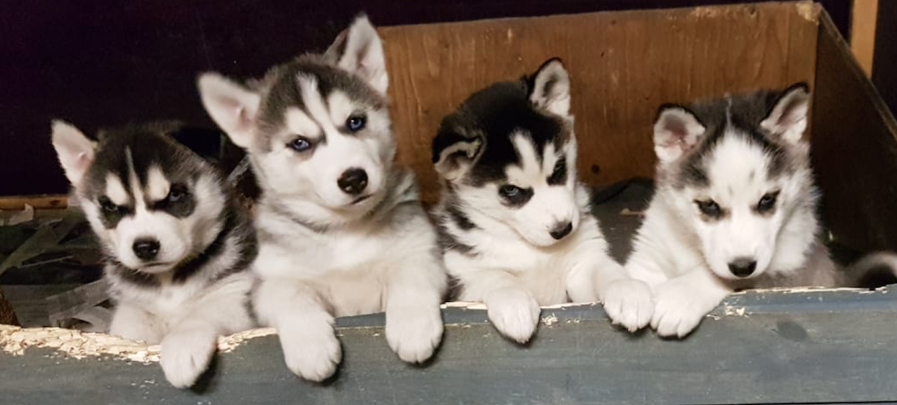

---

permalink: index
title: Siperianhuskyn pentuja 2021
description: "Kuuhaukun kennel on säilyttänyt old line siperianhuskyn linjan puhtaana 40 vuotta eikä siinä ole kilpa-tai showlinjaa"

menu: etusivu
layout: etusivu

dia-1-kuva: siperianhuskyvaljakko.jpg
dia-1-title: Kuuhaukun kennel
dia-1-teksti: Kuuhaukun kennel® on säilyttänyt old line® linjan puhtaana 40 vuotta
              eikä siinä ole kilpa-tai showlinjaa, mikä on varmaan ainutlaatuista minkään rodun  historiassa.

dia-2-kuva: siperianhusky-koiravaljakko.jpg
dia-2-title: old line® siperialaiset
dia-2-teksti: Kuuhaukun kennel on Euroopan vanhin ja nykyisin ainoa Old line®
    siperianhuskyja kasvattava kennel ja sen päämääränä on säilyttää 
    alkuperäinen vanhan linjan siperianhusky.

dia-3-kuva: valjakko-vetaa.jpg
dia-3-title: Arktiset rekikoirat
dia-3-teksti: Oikeat arktisen rekikoiran käyttöominaisuudet ja ulkomuoto ovat 
  tärkeitä säilyttää  jalostuksessa. Käyttöominaisuuksia testataan säännöllisellä harjoittelulla.
  
dia-4-kuva: img3.jpg
dia-4-title: Luonne ja terveys  <small>ystävällinen ja lempeä</small>
dia-4-teksti: Kasvatit ovat tunnettuja hyvästä luonteestaan. 
    Oikeaan luonteeseen ja terveyteen kiinnitetään paljon huomiota. 
    Jalostuskoirat on mm. silmätarkastettu 90-luvulta lähtien.
    
kolme-esiin:
    - "historia"
    - "siperianhuskytietoa"
    - "tsukotkan-rekikoira" 

---

*Kuvassa lokakuun 2020 pentuja*

Vuoden ensimmäinen pentue on jo syntynyt! Kuuhaukun kennel on saattanut maailmaan jo yli 100 pentuetta ja viimeisin syntyi 1.1.2021. 

Poikkeuksellisesti osa näistä pennuista on vielä vapaana. 

Myös myöhemmistä vuoden 2021 pentueista on nyt mahdollista varata pentuja.  [Ota yhteyttä!](yhteystiedot)

<a href="http://siperianhusky.net/" target="_blank" style="color:rgba(0,0,0,0);">siperianhusky</a>

