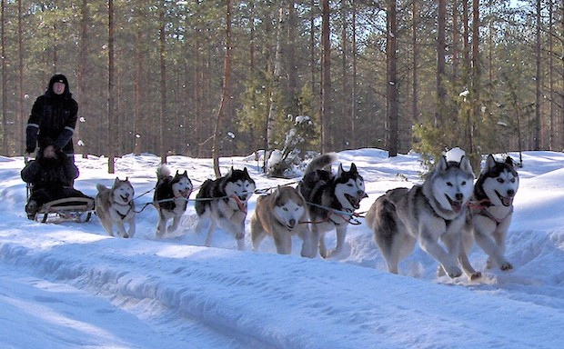

# Kuuhaukun Kennel's Web Site

**Jaana Sudensaaga holds the copyright for all graphic content, photos and articles** in this repository. Possible other copyright holders are mentioned in the relevant articles.

This repository is public to encourage Siperianpystykorva-86 ry's people and kennel's puppy-owners to help with the maintenance. 

This is a Jekyll-based website with Bootstrap 4 custom theme. We have implemented several things to help non-technical people update the articles. You can use the code here to learn how to implement:

- Dynamic menus that can be defined in YAML frontmatter and _config.xml
- Menu pages that automatically fill in links to the related articles
- Link ordering for automatically filled link pages
- Layouts with image sidebar that can be populated in YAML frontmatter

If you're here to contribute, that's wonderful! Please [read these general instructions first](_read-this-first.md).