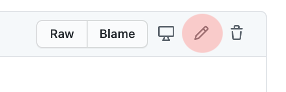

# Welcome! Here's what you need to know to contribute

## Click and it's online!

Whenever you save (that means commit + push) a file to this repository, **it goes to the online website immediately**! Only exception is the [_drafts directory](../_drafts). You can work in that directory until your article is ready.

**Please commit only finished content that is ready for the world to see**. 

## When you're ready, always test that your changes work

When you first save new content, leave the `menu:` empty. Use the address in the `permalink:` to see how the live page looks like. Then you're ready to put it into a menu or link it to the existing pages.

After the last save, run this [Dead link checker](https://www.deadlinkchecker.com). Put https://siperianhusky.com to the text field and select to check "whole website".

## Edit without fear

If something goes wrong, changes can be safely rolled back. Just let us know and we'll help.

Yes, you can break things, especially while editing the control section (it's called frontmatter) in the beginning of the files. It doesn't matter, because everything is reversible.

So go ahead, do the needed changes and have fun!

## There are nice tools that make things easier

It's perfectly fine to edit files here in Github web site. Just click the pen icon on the upper right corner of the file you need to change. When you're ready, fill in the commit-dialog under the file.

However, If you plan to make a lot of changes, you may want to do that in your own computer. To do so, you can install these tools to your computer. They work on both Mac and PC:

- [Typora](https://typora.io/) is a free markdown editor and reader makes it easier to edit the files.
- [Github Desktop](https://desktop.github.com/) lets you edit the files in your local computer file system. 

You do need to learn the Git workflow of Fetching, Pulling, Committing and Pushing, but it's pretty much a single button in the Github Desktop software that you'll need to click.

## Thank you for your help!

Kuuhaukun kennel appreciates your effort.
