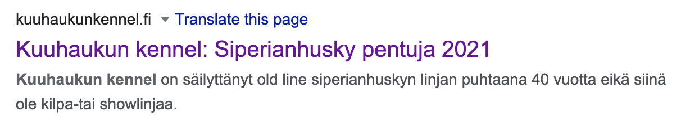

# How to add a new article

[1. Start with a template](#start-with-a-template)

[2. Fill in the frontmatter](#fill-in-the-frontmatter)

[3. Write the article content](#write-the-article-content)

## Start with a template

Go to the [_drafts directory](../_drafts) and duplicate one of the document templates that you can find there.

If you're writing in finnish, duplicate [_mallipohja.md](../_drafts/_mallipohja.md). 

If you're writing in english, duplicate [_template.md](../_drafts/_template.md).

## Fill in the frontmatter

There is a control section in the beginning of the file that defines how the article looks. It's called frontmatter. 

Here's the reference of what the variables do

| `permalink:`        | testi                                                        |
| ------------------- | ------------------------------------------------------------ |
|                     |    |
| `title:`            | The main H1 title for the article. Also visible in google seach results. |
| `description:`      |                                                              |
| `menu:`             |                                                              |
| `image:`            |                                                              |
| layout:             |                                                              |
| linkin-pikkukuva:   |                                                              |
| linkin-teksti:      |                                                              |
| kolme-esiin-title:  |                                                              |
| kolme-esiin-teksti: |                                                              |
| kolme-esiin-kuva:   |                                                              |
| sivukuvat:          |                                                              |

## Write the article content

 [Markdown cheat sheet](https://www.markdownguide.org/cheat-sheet/)

